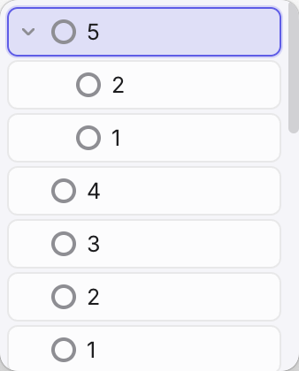

# 🌗 截图
<p align="center">
  
</p>

## ✨ 优化特性

- **支持多层todo**
- **极致简洁**

## 🚀 快速开始

确保你的电脑上已经安装了 [Node.js](https://nodejs.org/)。

### 1. 克隆项目
```bash
git clone https://github.com/andeyibiao/TinyTodo.git
cd tinytodo
```

### 2. 安装依赖
```bash
npm install
```

### 3. 开发环境运行
```bash
npm start
```
*此命令将启动并在本地直接打开 TinyTodo 窗口进行调试预览。*

## 📦 打包与分发

如果希望打包出一份可以发给别人或者直接安装到本地“应用程序”中的 macOS 镜像盘（`.dmg`）：

```bash
npm run dist
```
*构建成功后，所有的安装包文件均会输出在根目录的 `dist/` 文件夹中。*
